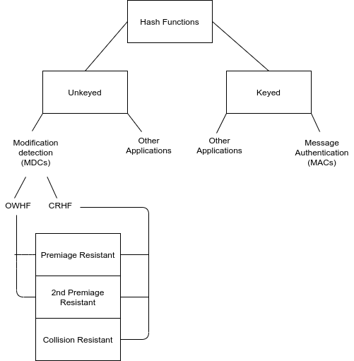
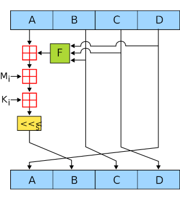

# Overview

## Morgan Reilly | G00303598

## Introduction
_An introduction to your repository and code. Describe
what is contained in the repository and what the code does._

#### Introduction to Cryptograpic Hash Functions
Cryptographic hash functions play a largely fundamental role in day-to-day cryptography. These are often referred to simply as hash functions, and take a message as input and produce an output known as _hash-value_, _hash-code_, or just as _hash_. Hash functions are used for data integrity in tandem with digital signature schemes, which is hashed first, then the hash-value is signed in place of the original message. [[1]](http://cacr.uwaterloo.ca/hac/)

#### About MACs
Message Authentication Codes, which are a distinct class of hash functions, allow message authentication through symmetric techniques. These may be viewed as hash functions which take a message and a secret key, and produce a fixed size output. MACs are used to provide data integrity and symmetric data origin authentication.[[1]](http://cacr.uwaterloo.ca/hac/)

#### Hash Function Classes
Hash functions can be split into two classes: _unkeyed hash values_ and _keyed hash values_. An _unkeyed hash value_ dictates a single parameter input, usually called a message. Whereas a _keyed hash value_ dictates two input parameters, a message and a key. [[1]](http://cacr.uwaterloo.ca/hac/)

#### Definitions
The Definition of a hash function, according to the [handbook of applied cryptography Chapter]((http://cacr.uwaterloo.ca/hac/))[9.1], is a function which has, as a minimum, the following two properties:
1. compression:
   _h_ maps an input _x_ of arbitrary finite bit length, to an output _h(x)_ of fixed bit length _n_.
2. ease of computation:
   given _h_ and an input _x_, _h(x)_ is easy to compute 
   
In more detail, a more functional classification of two types of hash functions exist. They are as follows:
1. modification detection codes (MDCs): These are also known as manipulation detection codes. The purpose of these are to provide a representative hash of a message. They fall into two categories:
i. one-way hash functions (OWHFs): These are largely difficult to find an input which hashes to a pre-specified hash value.
ii. collision resistant hash functions (CRHFs): These are difficult to find any two inputs which have the same hash-value.
2. message authentication codes (MACs): The purpose of these are to facilitate assurances in both source of a message, and its integrity. [[1]](http://cacr.uwaterloo.ca/hac/)

#### Basic Properties & Definitions
To expand further on the above definitions, as per chapter 9 of the handbook of applied cryptography, there are three properties listed for an unkeyed hash function _h_ with inputs _x_ , _x^1_ and outputs _y_, _y^1_, there are as follows:
1. preimage resistance: This is essentially for all pre-specified outputs, and is known to be computationally infeasible to find any input which hashes to that output
2. 2nd premiage resistance: This is computationally infeasible to find any second input which has the same output as any specific input
3. collision resistance: This is where it is computationally infeasible to find any two distinct inputs _x_, _x^1_ which hash out to the same output.

#### About MD4
MD4 was designed for software implementations on 32-bit machines. However, security concerns motivted the design of MD5, which is a more conservative version of MD4. Other versions include the SHA and RIPEMD implementations. The original MD4 (128-bit hash function) was designed in such a way that breaking it would require brute-force effort (2^64 operations) and finding a message yeilding a pre-specified hash-value (s^128 operations). MD4 was proven to never meet this goal. It serves, instead, as a convienient reference for describig and allowing coparisons between other hash functions in this family. Collisions have been found at 2^20 computations for MD4.

#### About MD5
MD5 was designed as a strengthened version of MD4, prior to actual MD4 collisions being found. MD5 is obtained from MD4 by making 6 modifications. These are outline below in reference X. Currently there have been no collisions found on MD5.

#### About this Repository
This repository contains the following:
* [.gitignore](./.gitignore) : This file allows git to ignore any files that are not meant to be in version control
* [LICENCE](./LICENCE)
* [README.md](./README.md) : This is a brief overview of the project, and instructions to run.
* [global.h](./global.h) : This is a header file which pre-defines global data types for use in the main file, which could be used more abstractly.
* [md5.c](./md5.c) : This is the main runner file which contains the MD5 C compiled code
* [md5.h](./md5.h) : This is a header file which pre-defines data types for specific use with the main runner file (md5.c).
* [overview.md](./overview.md) : This report on the project. 

#### About the Code
The code is written in C, and is separated out into 3 components:
1. [md5.c](./md5.c)
2. [md5.h](./md5.h)
3. [global.h](./global.h)
An overview of the purpose of these components are outlined in the section above this.
The code itself allows the user to choose via command line if they would like to input a string or a file to generate an MD5 hash. This is done by breaking the input message into blocks, padding where necessary, then applying the hashing function and returning the message.

## Run
__You should explain how to download, compile, and run your code.
Include instructions of how to install the compiler.__

## Test
__Explain how to run the tests included in your code.__

## Algorithm
__Give an overview and explanation of the main algorithm(s)
in your code. You might use a well-thought out diagram here.__

## Complexity
__This should be the most significant part of the report.
You must give an analysis of the complexity of the MD5 algorithm,
including the complexity of algorithms that attempt to reverse the
algorithm. That is, algorithms that attempt to find an input for
which the MD5 algorithm produces a given output. You should
research this topic before writing this section and your analysis
should be carefully referenced.__

## References
__Provide a list of references used in your project. The
references should not just be a list of websites. Instead, there
should be a short explanation of why each reference is relevant to
your document.__
